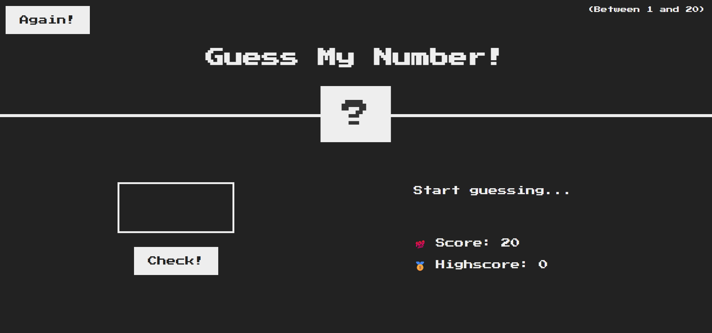

# 🎯 Number Guessing Game

A fun and interactive **Number Guessing Game** built using **HTML, CSS, and JavaScript**. The user tries to guess a randomly generated number within a set range, with real-time feedback and scoring.

## 🛠️ Features

- 🔢 Random number generation
- 🎯 Input validation and instant feedback
- 🧠 Tracks number of attempts
- 🔄 Play again option
- 🎨 Clean and responsive UI with CSS

## 📸 Screenshot

 <!-- Replace with actual image if available -->

## 🧩 How to Play

1. Enter your guess in the input box.
2. Click the "Check" button.
3. Receive feedback whether your guess is too low, too high, or correct.
4. Try to guess the number in the fewest attempts possible!
5. Click "Play Again" to restart the game.

## 🚀 Getting Started

### Clone the Repository

```bash
git clone https://github.com/Akshay-GH/number-guessing-game-.git
cd number-guessing-game-
start index.html

```
